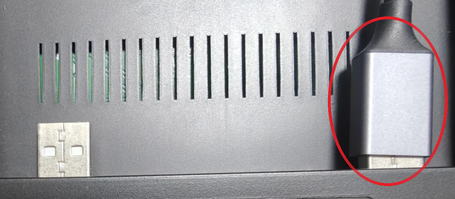

# RetroDumper

レトロフリーク カートリッジアダプタ (RFCA) を PC に直結して ROM を吸い出す Windows アプリ。

- アダプタが扱う 7 機種に対応（SFC / GB・GBC / GBA / ファミコン / メガドライブ / マークIII・ゲームギア / PC エンジン）
- SFC は **SA-1 / S-DD1 / ExHiROM** も読めます
- 吸い出した ROM を No-Intro と自動照合します
- セーブデータの吸い出し・書き戻し・消去ができます

## 必要なもの

- レトロフリーク カートリッジアダプタ（本体は不要）
- USB 延長ケーブル（**Type-A オス ⇔ Type-A メス**）— [UGREEN USB3.0 延長ケーブル 1m](https://amzn.asia/d/0fDq5Mam) で動作を確認しています
- Windows 10 / 11（ドライバ不要。CDC クラスドライバが自動で当たる）

アダプタ背面には USB ポートが 2 つあります。  
**吸い出し機側（USB ハブでない方）** を PC に挿してください。  
写真の赤丸の側です。  
挿すと仮想 COM ポートが 1 つ増えます。

## 起動

`RetroDumper.exe` をそのまま実行してください。  
.NET の入っていない PC でも動きます。

ソースからビルドする方法は [README-dev.md](README-dev.md) にあります。

## 使い方

1. **ポート自動検出** を押す（見つかるとそのまま接続します）
2. カセットを挿して **種別再取得**（挿入中カセットが表示される）
3. **カセットを識別** → タイトル・マッパー・容量・チェックサムを確認
4. **吸い出し開始** → 保存先を指定

見つからないときは「COM ポート」から手で選んで **接続** してください。  
全 COM ポートに状態要求を投げて、応答を返すポートを探す仕組みです。

### セーブデータ

**対応するのはゲームボーイ・ゲームボーイカラー・ゲームボーイアドバンスだけです**。
他の機種では、セーブデータ欄のボタンを押せません。

GBA はセーブ装置（EEPROM / SRAM / フラッシュ）を自動で判別します。
GB・GBC は MBC1 / MBC3 / MBC5 / HuC1 に対応しています。

**書き込みは既定で禁止です**。
「セーブデータの書き込みを許可する」を有効にしたときだけ書けます。
ROM 領域へはこの設定に関わらず書き込めません。

書き込む前に今のセーブを控え、書いた後に読み戻して 1 バイトずつ照合します。
読み出しが安定しないときは、書かずに止めます。
失敗したときは、その場で控えを書き戻せます。

**控えはファイルになりません**。
残しておきたいときは、先に「セーブを吸い出す」で保存してください。

#### セーブの消去

**セーブを消去する** で、セーブ領域を全面同じ値で埋めます。
ゲームからは「セーブなし」として扱われます。

**消したセーブは戻せません**。
残しておきたいときは、先に「セーブを吸い出す」で保存してください。

埋める値は `0xFF` のままで構いません。
フラッシュと EEPROM はこれが消去済みの状態で、SRAM では値に意味がありません。

## 対応状況

| 機種 | ROM の吸い出し | セーブの読み書き |
|---|---|---|
| スーパーファミコン | 実機確認済み（LoROM / HiROM / ExHiROM / SA-1 / S-DD1） | **未対応**（下記） |
| ゲームボーイ / カラー | 実機確認済み | 実機確認済み（MBC1 / MBC3 / MBC5 / HuC1） |
| ゲームボーイアドバンス | 実機確認済み | 実機確認済み（SRAM / EEPROM / フラッシュ 64KB・128KB） |
| ファミコン | 実機確認済み | **未対応** |
| PC エンジン | 実機確認済み | セーブ無し（天の声などは未対応） |
| メガドライブ | 実機確認済み（ソニック・ザ・ヘッジホッグ 1 / 2） | **未対応** |
| マークIII / ゲームギア | 実装済み・**実機未確認** | **未対応** |

未対応: SFC の SPC7110（バンク `$C0`〜`$FF` の 4MB のみ）、SF メモリカセット、GB の MBC2 / MBC6 / HuC3 / ポケットカメラ（実装はありますが実機で試せていません）。

実機で確かめられていないものは、吸い出した ROM を No-Intro と照合して確認してください。  
一致すれば、正規ダンプとバイト単位で同一だと言い切れます。

実機を使わない検証として、カートリッジのバスデコードを模したテストが 401 件あります。  
ROM オフセットとバスアドレスの変換が往復で一致することを確かめていますが、**実機でしか出ない食い違いはこれでは見つかりません。**

## うまくいかないとき

### 読み出しが全バイト 0xFF になるとき

**まずカートリッジを挿し直してください。**

アダプタは接触不良でも種別コードだけは正しく返します（検出ピンとデータバスが別系統のため）。  
「アダプタは認識しているのにバスが死んでいる」ように見えますが、実際は挿し直すだけで直ることがあります。  
実際に GBA でこれに時間を使いました。

## No-Intro による照合

吸い出した ROM は、No-Intro の正規ダンプと CRC32 / MD5 / SHA-1 で自動照合します。  
一致すれば、容量も含めて正規ダンプと同一だと言い切れます。

**データベースは EXE に埋め込んであります**。何も用意せずに使えて、アダプタが扱う 7 機種すべて（計 23,131 件）を収録しています。

保存するときのファイル名には、照合で特定した名前を使います。  
カセットのヘッダにある `POKEMON EMER` ではなく`Pocket Monsters - Emerald (Japan)` になります。

新しい DAT に差し替えたいときは、EXE と同じ場所に `DataBase` フォルダを作り、`*.dat` を置いてください。  
同じ CRC32 のものは、そちらが優先されます。

## このアプリが作るファイル

**保存先を選んだファイルしか作りません**。  
診断や測定の結果は画面のログに出るだけで、EXE の横には何も置きません。

## 仕組みを知りたいときは

通信プロトコル、機種ごとのアドレス変換、容量の判定方法などは [README-dev.md](README-dev.md) にまとめてあります。

## ライセンス

[MIT License](LICENSE)。  
Copyright (c) 2026 dlTOMlb

使う・改変する・再配布する（有償でも）ことができます。  
改変版を非公開のまま配ることもできます。  
求められるのは、著作権表示とライセンス本文を同梱することだけです。

**無保証です**。  
このアプリはカートリッジへ書き込み、セーブを消すことができます。  
使った結果について作者は責任を負いません。

**同梱している DAT は MIT の対象外です**。  
他の企画の成果物で、それぞれの条件に従います。  
Retro Freak の名称と製品も各権利者に帰属します。  
くわしくは [NOTICE.md](NOTICE.md) を見てください。
