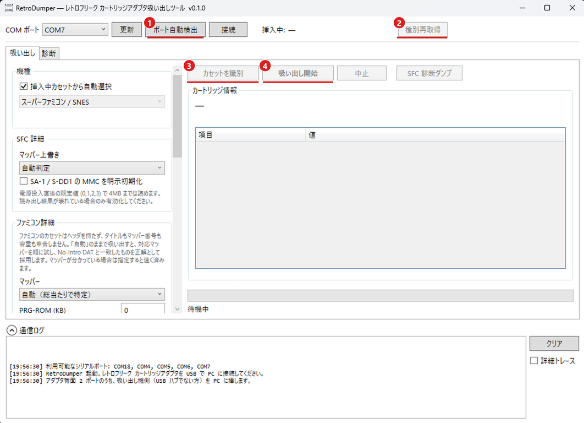

# RetroDumper

レトロフリーク カートリッジアダプタ (RFCA) を PC に直結して ROM を吸い出すアプリ。  
**Windows と Mac で動きます**。

- アダプタが扱う 7 機種に対応（SFC / GB・GBC / GBA / ファミコン / メガドライブ / マークIII・ゲームギア / PC エンジン。うちマークIII・ゲームギアは実機未確認）
- 特殊チップの入ったカセット（星のカービィ3、ヨッシーアイランド など）も読めます
- 吸い出した ROM を No-Intro と自動照合します
- セーブデータの吸い出し・書き戻し・消去ができます

## 必要なもの

- レトロフリーク カートリッジアダプタ（本体は不要）
- USB 延長ケーブル（**Type-A オス ⇔ Type-A メス**）
- **Windows 10 / 11** か **macOS 11 以降**（ドライバは要りません）

延長ケーブルは [UGREEN USB3.0 延長ケーブル 1m](https://amzn.asia/d/0fDq5Mam) で動作を確認しています。

アダプタ背面には USB ポートが 2 つあります。  
**吸い出し機側（USB ハブでない方）** を PC に挿してください。  
写真の赤丸の側です。

## 起動

何かを入れておく必要はありません。

**Windows** では `RetroDumper.exe` をそのまま実行してください。

**Mac** では CPU に合ったものを選んでください。

| | ファイル |
|---|---|
| Apple シリコン（M1 以降） | `RetroDumper-osx-arm64.zip` |
| Intel Mac | `RetroDumper-osx-x64.zip` |

展開して `RetroDumper.app` を開くだけです。  
Apple の公証を受けてあるので、警告は出ません。

## 使い方

1. **ポート自動検出** を押す（見つかるとそのまま接続します）
2. カセットを挿して **種別再取得**（挿入中カセットが表示されます）
3. **カセットを識別** → タイトルと容量を確認
4. **吸い出し開始** → 保存先を指定

ポートが見つからないときは、一覧から手で選んで **接続** してください。  
Windows では `COM3` のような名前、Mac では `USB (RetroFreak PCB-B)` と出ます。

### セーブデータ

**対応するのはゲームボーイ・ゲームボーイカラー・ゲームボーイアドバンスだけです**。  
他の機種では、セーブデータ欄のボタンを押せません。

## 対応状況

| 機種 | ROM の吸い出し | セーブの読み書き |
|---|---|---|
| スーパーファミコン | 対応 | 未対応 |
| ゲームボーイ / カラー | 対応 | 対応 |
| ゲームボーイアドバンス | 対応 | 対応 |
| ファミコン | 対応 | 未対応 |
| メガドライブ | 対応 | 未対応 |
| PC エンジン | 対応 | セーブ無し |
| マークIII / ゲームギア | **実機未確認** | 未対応 |

**7 機種のうち、マークIII / ゲームギアだけは実機で試せていません**。  
手元にソフトが無いためです。  
吸い出せたら No-Intro と一致するか確かめてください。

**天外魔境ZERO（5MB）は実機で確認しました**。  
4MB を超える容量で、他のカセットとは違う読み方をします。  
ヘッダは容量を 2 のべき乗でしか書けないので 8MB と名乗りますが、実容量は 5MB です。  
ヘッダを読むツールが 8MB と出しても、5MB で正しく吸い出せています。

**天外魔境ZERO 少年ジャンプの章は試せていません**。  
同じチップ・同じ容量なので同じ手順で読みます。  
吸い出せたら No-Intro と一致するか確かめてください。

未対応: SF メモリカセット、PC エンジンの天の声、GB の MBC6。  
MBC6 は ROM の構造がほかの MBC と違い、8KB 単位で 2 か所を別々に切り替えます。

**GB の MBC2 / HuC3 / ポケットカメラは実機で試せていません**。  
手元にソフトが無いためです。  
吸い出せたら No-Intro と一致するか確かめてください。

## うまくいかないとき

### 読み出しが全バイト 0xFF になるとき

**まずカートリッジを挿し直してください**。  
アダプタが認識していても、接触が悪いことがあります。  
挿し直すだけで直る場合がほとんどです。

挿し直しても直らないときは、端子の汚れを落とします。  
[コロンバスサークル レトロゲーム復活剤](https://amzn.asia/d/0aMfcVPm) を塗り、綿棒などで磨いてください。  
乾いてから挿し直します。

## No-Intro による照合

吸い出すたびに、No-Intro の正規データと一致するかを自動で確かめます。  
**一致すれば、正しく吸い出せたと言い切れます**。

7 機種ぶん（計 23,131 件）を内蔵しているので、何も用意する必要はありません。

保存するときの名前にも、照合で分かった正式名を使います。  
カセットに書かれた `POKEMON EMER` ではなく `Pocket Monsters - Emerald (Japan)` になります。

新しい DAT に差し替えたいときは、アプリと同じ場所に `DataBase` フォルダを作って `*.dat` を置いてください。  
Mac で同じ場所にあたるのは、`RetroDumper.app` を右クリック →「パッケージの内容を表示」で開く `Contents/MacOS/` です。

## このアプリが作るファイル

**保存先を選んだファイルしか作りません**。  
診断や測定の結果は画面のログに出るだけで、アプリの横には何も置きません。

## 仕組みを知りたいときは

通信プロトコル、機種ごとのアドレス変換、容量の判定方法などは [README-dev.md](README-dev.md) にまとめてあります。

## 問い合わせ

不具合の報告や質問は、次のどちらでも受け付けます。

- [GitHub Issues](https://github.com/dlTOMlb/RetroDumper/issues)
- X の [@TOM_KINNIKU](https://x.com/TOM_KINNIKU)

## ライセンス

[MIT License](LICENSE)。  
Copyright (c) 2026 dlTOMlb

使う・改変する・再配布する（有償でも）ことができます。  
改変版を非公開のまま配ることもできます。  
求められるのは、著作権表示とライセンス本文を同梱することだけです。

**無保証です**。  
このアプリはカートリッジへ書き込み、セーブを消すことができます。  
使った結果について作者は責任を負いません。

**同梱している DAT は MIT の対象外です**。  
他の企画の成果物で、それぞれの条件に従います。  
Retro Freak の名称と製品も各権利者に帰属します。  
くわしくは [NOTICE.md](NOTICE.md) を見てください。
